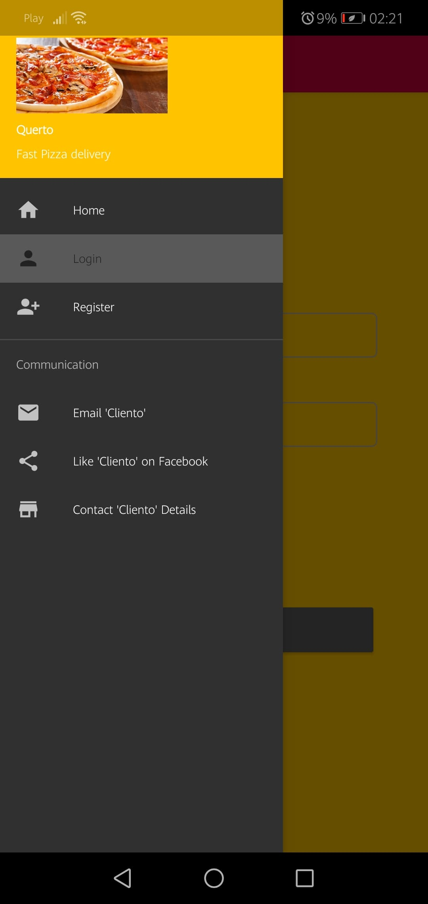
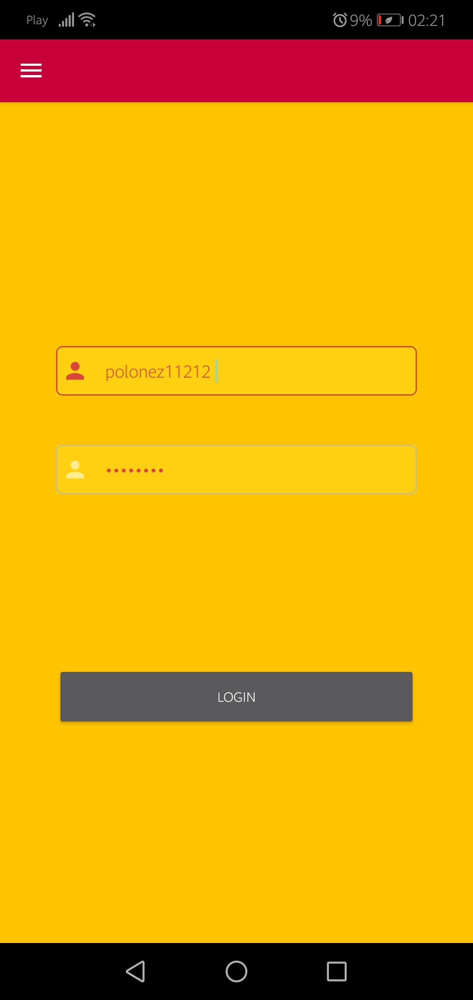
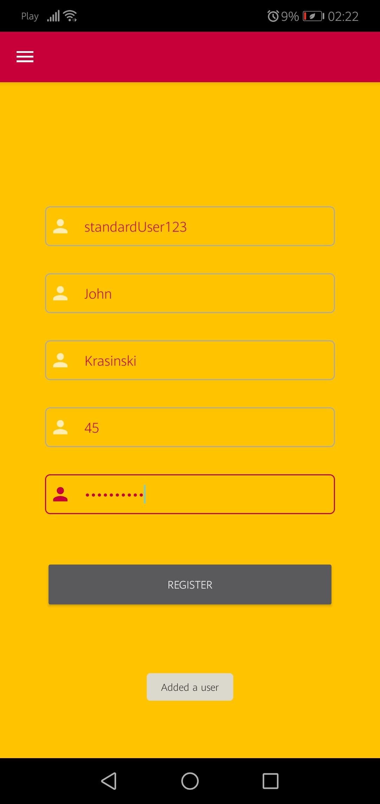
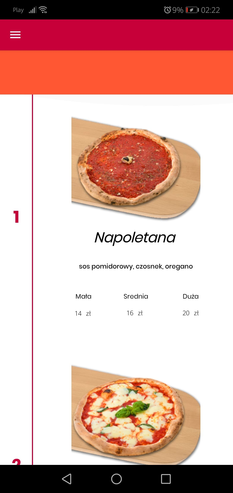
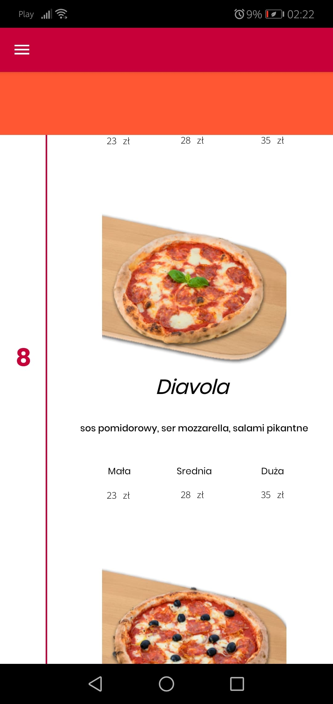

# Querto

App that allow fast ordering pizza 

This project is a build using MVVM architecture connected to Room Database

  
## 🕹️ Instalation and How to Use
Export project from Zip and Import full folder

App have slide menu on the left side  and will have menu in HomeFragment which allows choose kind of food option

  

## 💻 Progress

▰▰▰▰▰▰▱▱▱▱ 60%

 
  
## 🧭 What's next

* Menu with kind of food to order (done)
* Floating shopping button with animations and extra options
* Connection with database online (by Firebase)
* Login or Create an User by Google Account

  
## 📷 Screenshots
 
 ### Please remember that those photos may be outdated at current time
   

 
 
 
 
 

